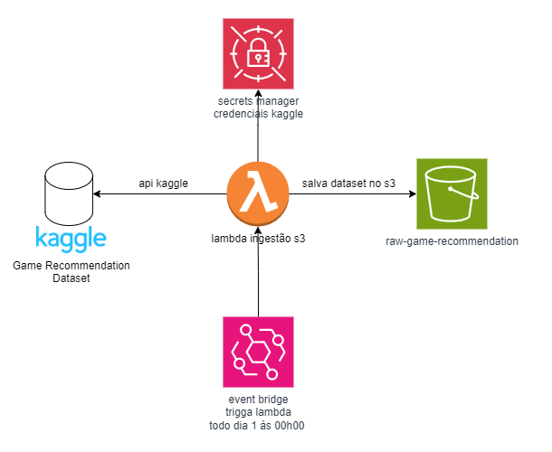

# Função Lambda para Ingestão de Dataset do Kaggle no S3

Essa função Lambda na AWS faz o download de um dataset do Kaggle usando a API do Kaggle e realiza o upload dos arquivos para um bucket no S3. As credenciais do Kaggle são obtidas do AWS Secrets Manager, e os arquivos do dataset são armazenados no bucket S3 com um caminho que organiza os arquivos por ano e mês atuais.

## Sumário
- [Visão Geral da Arquitetura](#visão-geral-da-arquitetura)
- [Variáveis de Ambiente](#variáveis-de-ambiente)
- [Dependências](#dependências)

## Visão Geral da Arquitetura

A arquitetura da aplicação consiste em:

1. **AWS Lambda**: Função responsável por orquestrar o download do dataset e o upload para o S3.
2. **AWS Secrets Manager**: Armazena as credenciais do Kaggle (usuário e chave API).
3. **Kaggle API**: Usada para baixar o dataset.
4. **Amazon S3**: Armazena o dataset baixado, organizado por ano e mês no nome do diretório.

### Diagrama de Arquitetura

## Variáveis de Ambiente
A função Lambda utiliza as seguintes variáveis de ambiente:

- **S3_BUCKET**: O nome do bucket S3 onde os arquivos serão armazenados.
- **SECRET_NAME**: O nome do segredo armazenado no AWS Secrets Manager que contém as credenciais da API do Kaggle.

## Dependências
Este código depende dos seguintes pacotes:

- **Kaggle API**: Biblioteca oficial do Kaggle para interagir com datasets.
- **AWS SDK para Python (Boto3)**: Para interação com S3 e Secrets Manager.
- **Pacotes Personalizados**:
    - S3Ingestion: Gerencia o upload de arquivos para o S3.
    - SecretsManager: Gerencia a recuperação de segredos armazenados.

